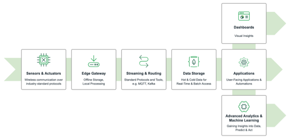
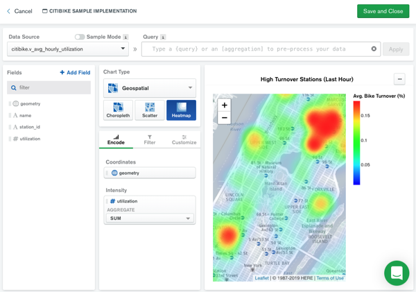
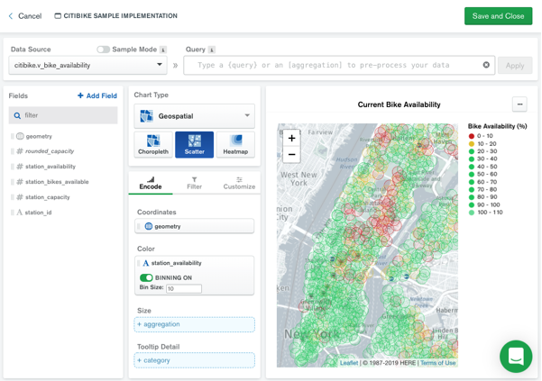
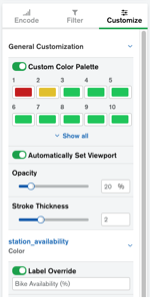

# MongoDB IoT Reference Implementations

This repository provides you with the reference implementations that have initially been presented during MongoDB.live on 9-10 June 2020. The slides (TODO:LINK) and a recording (TODO:LINK) are available as soon as the event took place.

All implementations follow the same pattern (see diagram below). Sensors and actuators are the heart of any IoT application. Usually an edge gateway is used to gather the data from the actual devices and send it to the backend - here we use the citibike data as an example. Edge computing also makes it possible to process data locally and avoid the additional latencies in transferring data to a central data center or the cloud. A streaming and routing layer is responsible for secure and guaranteed bi-directional data transfer across potentially unstable networks to the backend. From the backend, data is streamed into a hot data storage layer for real-time data processing. To support batch analysis and machine learning across a large amount of data, a cold data tier can be used. The data can be used for visualization in dashboards and end-user applications as well as for advanced analytics and machine learning.



The following examples are provided and kept as simple as possible so you will be able to set them up quickly and compare the different solutions and cloud providers with each other:

- [MongoDB Atlas only](mongodb-atlas)
- [MongoDB Atlas and AWS IoT Core](mongodb-aws)
- [MongoDB Atlas and Azure IoT Hub](mongodb-azure)
- [MongoDB Atlas and GCP IoT Core](mongodb-gcp)
- [MongoDB Atlas and HiveMQ](mongodb-hivemq)
- [MongoDB Atlas and HiveMQ and Kafka](mongodb-hivemq-kafka)

## Disclaimer
This repository aims to provide you with a starting point on how to integrate and use MongoDB in IoT solutions. We want to show you how a solution looks like with MongoDB-only products, in the ecosystem with MQTT and Kafka as well as on different cloud providers (AWS, Azure, GCP). The  consistent and simple approach enables you try out each solution and can compare the different cloud providers to each other. The key aspects of MongoDB are the flexibility of its data model to store any kind of data, high availability and scalability out-of-the box from pilot phase into production with multiple TB of data as well as the deployment agnosticity from edge to cloud - from gateways to on-premises and cloud-agnostic fully managed service. 

## Credits
Credits to the collaborators who helped to build these implementations:
* [Christian Kurze](https://github.com/ckurze) - MonogDB Atlas, HiveMQ, Kakfa & Framework
* [Hauke Melius](https://github.com/hmelius2204) - AWS
* [Marco Sabotinski](https://github.com/marcosabotinski) - GCP, Azure
* [Julian Storz](https://github.com/JSdotPY) - MongoDB Atlas & Framework

## Prerequisites

- [MongoDB Atlas Account](https://account.mongodb.com/account/login): Please follow the instructions in the [MongoDB Atlas Getting Started Guide](https://docs.atlas.mongodb.com/getting-started/) and spin up a free tier cluster. **Please make sure to use MongoDB version 4.2 or newer**. 

  You are required to whitelist the IP address of the gateway (see hints in the implementations), otherwise you cannot access the data in your cluster from the gateway. More advanced options like VPC/VNet peering or AWS Private Link are also available (see the [docs](https://docs.atlas.mongodb.com/setup-cluster-security/) for more details).
- Python 3.x with at least `pymongo` and `dnspython` installed
- More dependencies are outlined for each reference implementation

## Visualization
After starting the demo (which should create all the necessary collections and views in MongoDB Atlas automatically), you can create a dashboard in MongoDB Charts. There are good introductory [documentation as well as tutorials](https://docs.mongodb.com/charts/master/) available.

You can create a new dashboard with a heatmap for the high turnover stations as well as a scatter plot for the current bike availability as shown in the screenshots below.

After creating two data sources for the views in MongoDB (see below for a description of the views), you can create two charts in your dashboard and configure them as following:

- Geo Heatmap (based on the view v_avg_hourly_utilization): 

  

- Geo Scatterplot (based on the view v_bike_availability): 

  

- Customization of the Geo Scatterplot for highlighting low bike availability and renaming the bike availability:

  

## Modelling Time Series in MongoDB
We follow the best practices to model time series data in MongoDB. [We summarized an overview in Jupyter Notebooks to get your started](./mongodb-timeseries/README.md).

## Data Model and Views in MongoDB
- stations: A plain import of the stations as it is delivered by the bike share feed:
  ```json
  {
  	"_id":"72",
  	"name":"W 52 St & 11 Ave",
  	"electric_bike_surcharge_waiver":false,
  	"station_type":"classic",
  	"short_name":"6926.01",
  	"rental_url":"http://app.citibikenyc.com/S6Lr/IBV092JufD?station_id=72",
  	"capacity":55,
  	"region_id":"71",
  	"rental_methods":["CREDITCARD","KEY"],
  	"eightd_has_key_dispenser":false,
  	"has_kiosk":true,
  	"eightd_station_services":[],
  	"external_id":"66db237e-0aca-11e7-82f6-3863bb44ef7c",
  	"geometry":{"type":"Point","coordinates":[-73.99392888,40.76727216]}
  }
  ```
- status: The current status of the bike stations - using the bucketing schema for time series data as explained above:
  ```json
  {
  	"_id":{"$oid":"5ecffa62f1e8335189b5a836"},
  	"station_id":"3923",
  	"bucket_size":120,
  	"expire_on":{"$date":{"$numberLong":"1590735115000"}}, /* 2020-05-29T06:51:55.000+00:00 */
  	"min_ts":{"$date":{"$numberLong":"1590688345000"}}, /* 2020-05-28T17:52:25.000+00:00 */
  	"max_ts":{"$date":{"$numberLong":"1590691915000"}}, /* 2020-05-28T18:51:55.000+00:00 */
  	"status":[
  		{
  			"station_status":"active",
  			"num_docks_available":{"$numberInt":"15"},
  			"num_docks_disabled":{"$numberInt":"0"},
  			"num_bikes_available":{"$numberInt":"1"},
  			"num_bikes_disabled":{"$numberInt":"1"},
  			"num_ebikes_available":{"$numberInt":"1"},
  			"is_renting":{"$numberInt":"1"},
  			"is_installed":{"$numberInt":"1"},
  			"is_returning":{"$numberInt":"1"},
  			"eightd_has_available_keys":false,
  			"last_reported":{"$date":{"$numberLong":"1590681077000"}},
  			"ts":{"$date":{"$numberLong":"1590688345000"}}
  		},{
  			"station_status":"active",
  			"num_docks_available":{"$numberInt":"15"},
  			"num_docks_disabled":{"$numberInt":"0"},
  			"num_bikes_available":{"$numberInt":"1"},
  			"num_bikes_disabled":{"$numberInt":"1"},
  			"num_ebikes_available":{"$numberInt":"1"},
  			"is_renting":{"$numberInt":"1"},
  			"is_installed":{"$numberInt":"1"},
  			"is_returning":{"$numberInt":"1"},
  			"eightd_has_available_keys":false,
  			"last_reported":{"$date":{"$numberLong":"1590681077000"}},
  			"ts":{"$date":{"$numberLong":"1590688375000"}}
  		},
  		/* ... */
  		{
  			"station_status":"active",
  			"num_docks_available":{"$numberInt":"15"},
  			"num_docks_disabled":{"$numberInt":"0"},
  			"num_bikes_available":{"$numberInt":"1"},
  			"num_bikes_disabled":{"$numberInt":"1"},
  			"num_ebikes_available":{"$numberInt":"1"},
  			"is_renting":{"$numberInt":"1"},
  			"is_installed":{"$numberInt":"1"},
  			"is_returning":{"$numberInt":"1"},
  			"eightd_has_available_keys":false,
  			"last_reported":{"$date":{"$numberLong":"1590681077000"}},
  			"ts":{"$date":{"$numberLong":"1590691915000"}}
  		}
  	]
  }
  ```
- v_bike_availability: Capacity and available bikes (absolute and percentage) per station:
  ```json
  {
  	"station_id":"3671",
  	"station_capacity":37,
  	"station_bikes_available":1,
  	"station_availability":2.7,
  	"geometry":{
  		"type":"Point",
  		"coordinates":[-73.95427465438843,40.774779448957275]
  	}
  }
  ```
- v_average_hourly_utilization: Average utilization during the last hour, i.e. how many bikes have been turned over on average during the last hour:
  ```json
  {
  	"station_id":"3614",
  	"name":"Crescent St & 30 Ave",
  	"geometry":{
  		"type":"Point",
  		"coordinates":[-73.9249574,40.768692]
  	},
  	"utilization":0.04
  	}
  }
  ```
